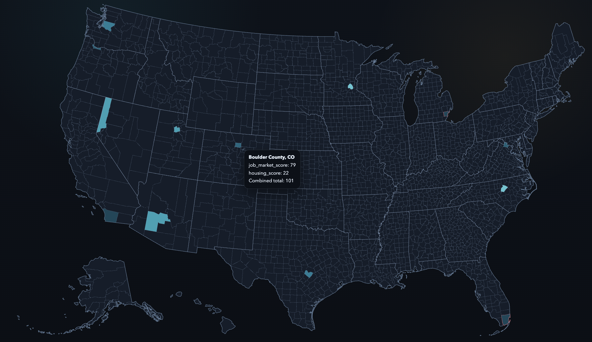

# Map Colorizer

Lightweight static single-page web app for coloring U.S. states or counties from a local CSV.



The app is fully client-side:
- no backend
- no login
- no ads
- no runtime downloads once `./mapColorizer` is on disk and served locally

## What it does

- Toggle between `States` and `Counties`
- Upload a local CSV or load a bundled sample CSV
- Detect available columns for mapping
- Color by:
  - `Numeric`
  - `Categorical`
- Stack multiple numeric columns and color by their summed total
- Adjust a `Visual Isolation` slider to fade unmatched regions
- Flag numeric rows with missing selected values using warning outlines and tooltip warnings
- Show a legend
- Show hover tooltips
- Show a click-based detail panel with the full row data
- Accept extra CSV columns beyond the required join key

## Architecture

The app uses a projected SVG renderer instead of Leaflet. That keeps the familiar inset-style U.S. map for Alaska and Hawaii simple and predictable, while staying lightweight and easy to inspect.

- `./mapColorizer/js/config.js`
  Central geography rules, projected boundary URLs, example-file paths, and map defaults.
- `./mapColorizer/js/csv.js`
  CSV parsing, normalization, numeric/categorical column detection, and join-key bookkeeping.
- `./mapColorizer/js/coloring.js`
  Numeric bucket coloring, categorical coloring, legend generation, and tooltip value logic.
- `./mapColorizer/js/boundaries.js`
  Projected boundary loading and caching.
- `./mapColorizer/js/mapRenderer.js`
  D3/SVG map drawing plus pan/zoom behavior.
- `./mapColorizer/app.js`
  UI orchestration, file loading, tooltips, modal dialogs, legend, and details panel.

That keeps the app easy to extend later if city support is added.

## File structure

```text
./mapColorizer/
├── README.md
├── index.html
├── styles.css
├── app.js
├── vendor/
│   ├── d3.v7.min.js
│   ├── papaparse.5.4.1.min.js
│   └── topojson-client.3.min.js
├── data/
│   ├── boundaries/
│   │   ├── counties-albers-10m.json
│   │   └── states-albers-10m.json
│   ├── reference/
│   │   └── us-counties-fips.csv
│   ├── example-counties.csv
│   └── example-states.csv
└── js/
    ├── boundaries.js
    ├── coloring.js
    ├── config.js
    ├── constants.js
    ├── csv.js
    └── mapRenderer.js
```

## Run locally

Serve the folder from a local web server. Opening `index.html` with `file://` will break local `fetch()` calls for CSV and boundary files.

```bash
cd ./mapColorizer
python3 -m http.server 8000
```

Then open:

```text
http://127.0.0.1:8000/
```

## Basic workflow

1. Start the local server.
2. Open the app in a browser.
3. Choose `States` or `Counties`.
4. Upload your CSV or load a sample CSV.
5. Pick `Numeric` or `Categorical` color mode.
6. If using `Numeric`, choose one or more numeric columns. Multiple numeric columns are summed before bucket coloring.
7. Use `Visual Isolation` to fade regions that do not have matching CSV rows.
8. Hover regions for a tooltip and click a region for the full row details.

## CSV join rules

### State mode

- Required join key: `state_abbr`
- Exact join rule: 2-letter state abbreviation

Example:

```csv
state_abbr,state_name,overall_score,housing_score,job_market_score,climate_band,recommendation
WA,Washington,74,38,82,Temperate-wet,Shortlist
NV,Nevada,73,65,71,Hot-dry,Shortlist
```

### County mode

- Required join key: `fips`
- Exact join rule: 5-digit county FIPS code
- County names are display-only and are not used for matching

Example:

```csv
fips,county_name,state_abbr,overall_score,housing_score,school_fit_score,pace,recommendation
53033,King County,WA,72,26,76,Major-metro,Maybe
48453,Travis County,TX,76,48,67,Tech-metro,Shortlist
```

Extra columns are allowed. They can be used for coloring and appear in the click detail panel.

## Numeric vs categorical detection

The app classifies columns automatically:

- A column is treated as numeric if every non-empty value can be parsed as a number.
- A column is treated as categorical if it is not a join column and not classified as numeric.

This works well for clean CSVs. It is stricter with values like `$1200`, `7%`, `1,200`, `N/A`, or numeric-looking code columns.

## Sample files

Bundled examples:

- `./mapColorizer/data/example-states.csv`
- `./mapColorizer/data/example-counties.csv`

These samples intentionally include a mix of:

- numeric scoring fields for single-column or stacked numeric coloring
- categorical fields for discrete coloring
- extra descriptive columns for the details panel
- a few blank numeric cells to demonstrate numeric-data warning states

The app also includes sample-data modal links in the UI so you can quickly inspect the expected raw CSV format.

## County FIPS reference file

If you are preparing county-level data and need to look up FIPS codes, use:

- `./mapColorizer/data/reference/us-counties-fips.csv`

Columns included:

- `fips`
- `state_fips`
- `state_abbr`
- `state_name`
- `county_name`

This file was generated from the same local county boundary data the app uses, so its county FIPS values line up with the map.

## Current UI notes

- The map uses a dark mode color scheme.
- Alaska and Hawaii are shown in the familiar inset-style U.S. layout.
- `About` and `Sample Data` use the same reusable modal path.
- Numeric coloring uses a single-hue teal ramp.
- `Visual Isolation` fades unmatched regions without changing matched ones.
- In numeric mode, red outlines indicate matched regions that are missing one or more selected numeric fields.
- Categorical colors are assigned deterministically so category colors do not change just because CSV row order changes.

## Tradeoffs and fragile areas

- The inset-style map is intentionally not scale-accurate. Alaska and Hawaii are repositioned for readability.
- Runtime dependencies are vendored locally, so the app does not need third-party network requests once `./mapColorizer` is on disk.
- The repo is larger because it includes local copies of D3, Papa Parse, TopoJSON client, and projected `us-atlas` boundary files.
- Dependency updates are manual. Replace files in `./mapColorizer/vendor/` and `./mapColorizer/data/boundaries/` when you want newer versions.
- Duplicate join keys are not aggregated. The last CSV row for a repeated `state_abbr` or `fips` wins.
- County rendering is heavier than state rendering because it draws far more polygons.
- County mode still expects `fips` for actual map joins. The bundled reference CSV helps you prepare that field, but the app does not yet auto-convert county names into FIPS during upload.

## Extend later

The current structure leaves a straightforward path for future geography types:

- add a new geography entry in `./mapColorizer/js/config.js`
- add a new boundary source
- add any join-key normalization needed in `./mapColorizer/js/csv.js`
- keep the rest of the UI flow largely unchanged
